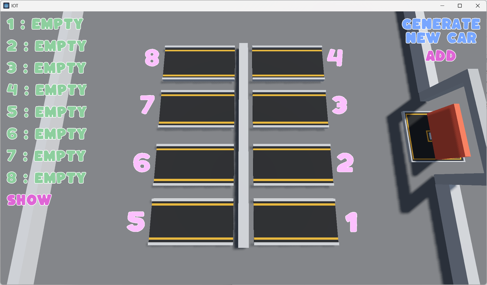
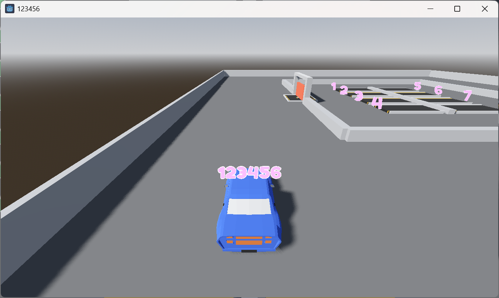
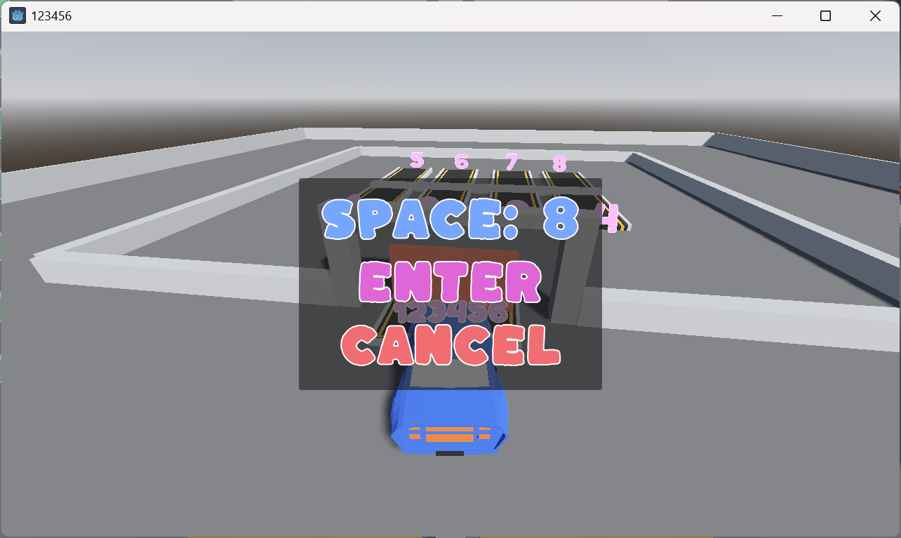
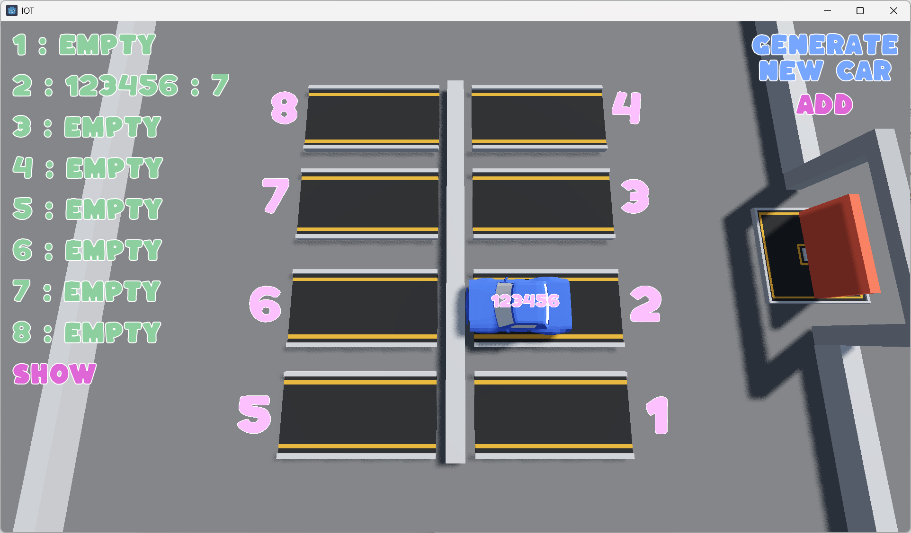
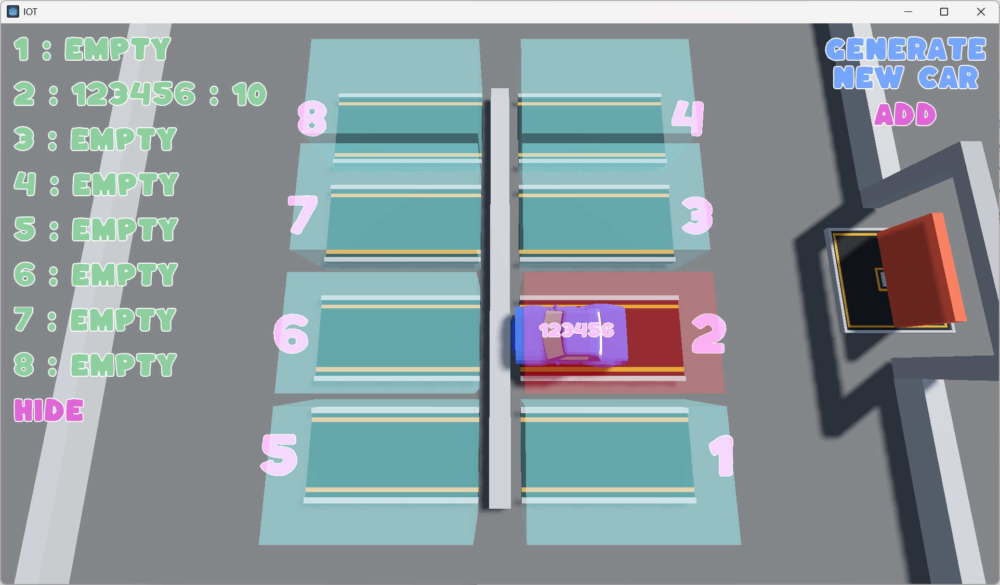

# SmartParking
采用Godot引擎完成的课程大作业

# 智慧停车场仿真系统设计与实现 🚗🅿️

本项目为物联网综合实验课程设计，使用 Godot 3D 引擎开发的智慧停车场仿真系统，实现车辆泊入、车位管理、状态显示等功能，模拟客户端与服务器的交互逻辑。虽然实际部署为单主机运行，但通过多窗口模拟客户端行为，展示了智能交通系统中典型的车位调度与状态反馈流程。

## 📌 项目简介

本项目构建了一个具备图形化界面、实时通信逻辑和多窗口交互的智慧停车场系统，包括：

- **停车场主控窗口（服务器端模拟）**：管理 8 个车位，实时展示每个车位的占用状态、车辆 ID、停车时长。
- **车辆窗口（客户端模拟）**：每添加一辆车即弹出一个新窗口，用户可手动控制小车移动，执行驶入与泊车操作。
- **通信机制**：采用 Godot 的信号与节点引用机制实现窗口间“客户端-服务器”逻辑通信，模拟 TCP 行为。

## 🎮 功能特色

- 🧠 自动判断是否可进入停车场，支持满位等待与拒绝逻辑
- 🚘 用户手动控制车辆移动、驶入、泊车、离开
- 📊 主窗口实时显示停车位状态、停车时长与车辆编号
- 🎨 3D 场景+UI 展示，支持车辆与车位的可视标识切换
- 🔲 多窗口交互体验，增强系统的可视化和模拟效果

## 📷 项目截图

  
*图：主窗口显示停车位状态*

  
*图：客户端小车窗口，用户可控制车辆移动*

  
*图：小车移动至停车场门口*

  
*图：小车进入停车场后，服务器端更新*

  
*图：服务器端高亮显示*

## ▶️ 使用说明

1. **启动项目**  
   运行主场景 `ParkingLot.tscn`，进入主控制窗口。

2. **添加车辆**  
   点击 UI 中的“添加车辆”按钮，会打开一个新窗口作为客户端小车，可由用户控制移动。

3. **停车流程**  
   - 将小车移动至停车场门口的 checkpoint
   - 系统自动检测是否允许进入
   - 允许进入时停车场大门打开，用户可驶入空车位，拉手刹完成泊车
   - 满位时，客户端小车将被暂时阻止进入

## 🧩 可拓展方向

- 真正的 TCP 通信（多主机连接）
- 自动泊车与路径规划算法
- 可视化统计面板（进出车辆记录、占用率等）
- 多车协同调度逻辑（如优先级、等待队列）
